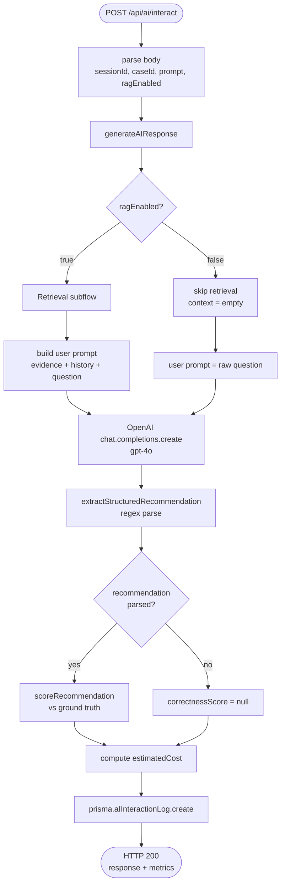
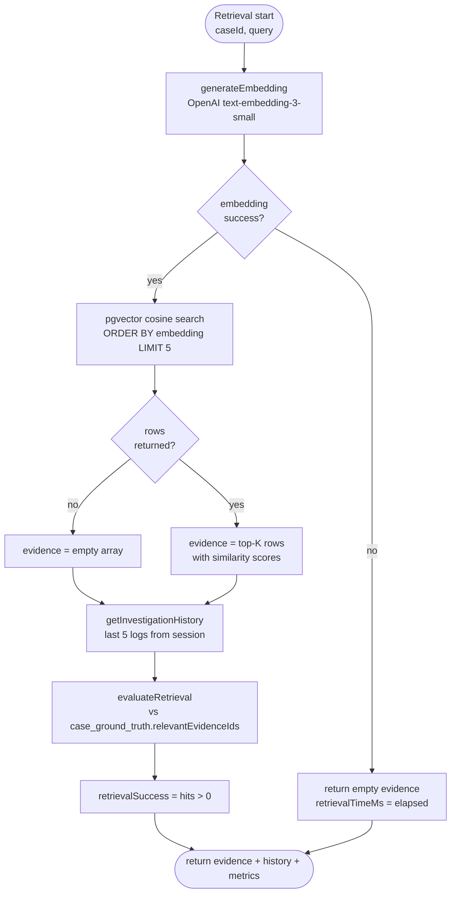
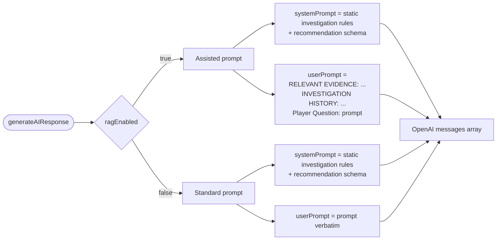
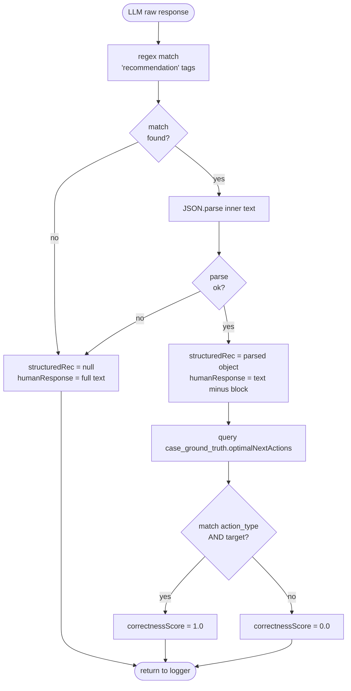
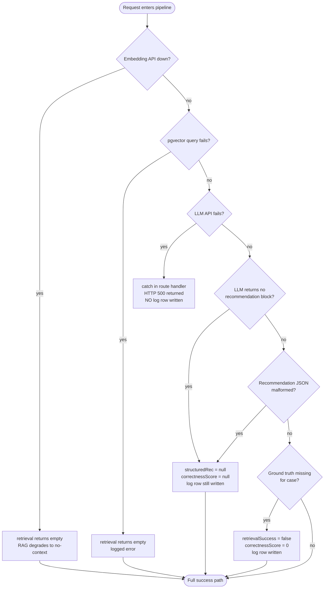
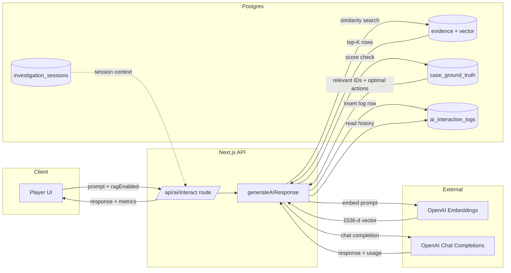

# RAG + LLM Technical Flow

Internal pipeline for retrieval-augmented LLM responses. Covers embedding, vector retrieval, prompt construction, LLM invocation, response parsing, and evaluation.

---

## 1. Component Map

```
┌─────────────────────────────────────────────────────────────┐
│  app/api/ai/interact/route.ts        (HTTP entry)           │
│      └─ generateAIResponse()         (lib/rag.ts)           │
│             ├─ retrieveRelevantEvidence()                   │
│             │      └─ generateEmbedding()  (lib/embedding)  │
│             │      └─ pgvector similarity query             │
│             ├─ getInvestigationHistory()                    │
│             ├─ evaluateRetrieval()                          │
│             ├─ OpenAI chat.completions.create()             │
│             ├─ extractStructuredRecommendation()            │
│             └─ scoreRecommendation()                        │
│      └─ prisma.aIInteractionLog.create()  (persistence)     │
└─────────────────────────────────────────────────────────────┘
```

---

## 2. Embedding Generation

**Function:** `generateEmbedding(text: string) → number[]`
**Location:** `lib/embedding.ts`
**Model:** `text-embedding-3-small`
**Output dimensions:** 1536
**API:** `openai.embeddings.create({ model, input: text })`

Returns the raw float array. No normalization or post-processing.

Used in two places:
- **Seed time** — embed each evidence `content` once, store in `evidence.embedding`
- **Query time** — embed the player prompt on every Assisted Mode request

---

## 3. Vector Storage

**Column:** `evidence.embedding`
**Type:** `vector(1536)` (pgvector extension)
**Prisma representation:** `Unsupported("vector(1536)")` — not exposed in generated client
**Access pattern:** raw SQL only (`$queryRaw`, `$executeRaw`)

### Insert pattern

```ts
await prisma.evidence.create({ data: { ...fields } })
await prisma.$executeRaw`
  UPDATE evidence
  SET embedding = ${JSON.stringify(embedding)}::vector
  WHERE id = ${id}
`
```

Two-step because Unsupported columns cannot be set via `create()`.

---

## 4. Retrieval Flow

**Function:** `retrieveRelevantEvidence(caseId, query, limit=5)`
**Operator:** `<=>` — cosine distance (lower = more similar)
**Similarity score:** `1 - distance` (higher = more similar)

### SQL executed

```sql
SELECT id, type, category,
       LEFT(content, 500) AS content,
       1 - (embedding <=> $1::vector) AS similarity
FROM evidence
WHERE case_id = $2
  AND embedding IS NOT NULL
ORDER BY embedding <=> $1::vector
LIMIT $3
```

### Returns

```ts
{
  evidence: RetrievedEvidenceItem[],   // { id, type, category, content, similarity }
  retrievalTimeMs: number              // wall clock from generateEmbedding start to query finish
}
```

### Failure handling

- OpenAI embedding error → returns empty array, retrievalTimeMs still recorded
- DB error → caught, logged, empty array returned
- Empty result → downstream prompt has no evidence section but still completes

---

## 5. Investigation History Retrieval

**Function:** `getInvestigationHistory(sessionId, limit=5)`
**Source:** `ai_interaction_logs` table
**Order:** `createdAt DESC`
**Returns:** last N `{ prompt, response, timestamp }` for the session

Used only when RAG enabled. Provides conversational continuity within a session.

---

## 6. Prompt Construction

### System prompt (constant)

```
You are an expert criminal investigation assistant.

When responding, you MUST always end your response with a JSON block in
this exact format:
<recommendation>
{
  "action_type": "INTERROGATE" | "EXAMINE_EVIDENCE" | "REVIEW_TIMELINE"
               | "SUBMIT_DEDUCTION" | "INVESTIGATE_LOCATION",
  "target": "<suspect name or evidence ID>",
  "reason": "<one sentence reason>"
}
</recommendation>
```

### User prompt — Standard Mode (RAG OFF)

```
<player prompt verbatim>
```

### User prompt — Assisted Mode (RAG ON)

```
RELEVANT EVIDENCE:
- [<type>/<category>] <content excerpt>
- [<type>/<category>] <content excerpt>
... (up to top-K)

INVESTIGATION HISTORY:
Q: <prior prompt 1>
A: <prior response 1>

Q: <prior prompt 2>
A: <prior response 2>
... (up to last 5)

Player Question: <player prompt>
```

The retrieved context is stored verbatim in `ai_interaction_logs.retrievedContext` so the experiment is replayable.

---

## 7. LLM Invocation

**Provider:** OpenAI
**Model:** `gpt-4o`
**Parameters:**

| Param | Value |
|---|---|
| `temperature` | 0.7 |
| `max_tokens` | 1000 |
| `messages` | `[{role: "system", ...}, {role: "user", ...}]` |

**Timing measured:** `llmResponseTimeMs` = `Date.now()` immediately before the call to immediately after.

**Token accounting:** taken from `response.usage`:
- `prompt_tokens` → `promptTokens`
- `completion_tokens` → `completionTokens`
- `total_tokens` → `totalTokens`

---

## 8. Response Parsing

**Function:** `extractStructuredRecommendation(text) → StructuredRecommendation | null`

Regex: `/<recommendation>([\s\S]*?)<\/recommendation>/`

Behavior:
- No match → returns `null`, no correctness scoring performed
- Match but `JSON.parse` fails → returns `null`
- Match valid → typed `StructuredRecommendation` returned

The human-readable response is the raw LLM output **with the `<recommendation>...</recommendation>` block stripped out** before being returned to the client.

---

## 9. Retrieval Evaluation

**Function:** `evaluateRetrieval(caseId, retrievedIds) → { retrievalSuccess, precision }`

Looks up `case_ground_truth.relevantEvidenceIds`. Compares the set of retrieved evidence IDs against the set of authored-relevant evidence IDs.

| Metric | Definition |
|---|---|
| `retrievalSuccess` | `true` if at least one retrieved ID is in the ground-truth relevant set |
| `precision` | `hits / retrievedCount` |

Only `retrievalSuccess` is currently persisted on the log row. `precision` is returned but not yet logged (extension point).

If the case has no ground truth, both default to `false` / `0`.

---

## 10. Correctness Scoring

**Function:** `scoreRecommendation(caseId, recommendation) → number`

Looks up `case_ground_truth.optimalNextActions` (array of `{ action_type, target, reason }`). Returns:

- `1.0` if any optimal action matches both `action_type` AND `target` of the model's recommendation
- `0.0` otherwise

Stored in `ai_interaction_logs.correctnessScore`.

This is intentionally strict-match. A future extension can move to partial credit (action_type match only, or fuzzy target match).

---

## 11. Cost Tracking

**Computed at request time:**

```ts
estimatedCost = promptTokens * COST_PER_INPUT_TOKEN
              + completionTokens * COST_PER_OUTPUT_TOKEN
```

Constants in `lib/rag.ts`:

| Constant | Value | Source |
|---|---|---|
| `COST_PER_INPUT_TOKEN` | 0.0000025 | gpt-4o input rate |
| `COST_PER_OUTPUT_TOKEN` | 0.00001 | gpt-4o output rate |

Persisted in `ai_interaction_logs.estimatedCost`. Updates require editing the constants if model pricing changes.

---

## 12. Persistence (Per Interaction)

Every `POST /api/ai/interact` writes one row to `ai_interaction_logs` with:

| Field | Source |
|---|---|
| `sessionId`, `caseId` | request body |
| `userPrompt` | request body |
| `aiResponse` | LLM output (recommendation block stripped) |
| `retrievedContext` | full evidence + history string (Assisted Mode only) |
| `retrievedEvidenceIds` | JSON array of evidence IDs from retrieval |
| `retrievalScores` | JSON array of similarity scores (parallel to IDs) |
| `retrievalSuccess` | from `evaluateRetrieval` |
| `structuredRecommendation` | parsed JSON or null |
| `ragEnabled` | request body |
| `retrievalTimeMs` | from `retrieveRelevantEvidence` |
| `llmResponseTimeMs` | wall clock around OpenAI call |
| `totalResponseTimeMs` | retrieval + LLM |
| `promptTokens`, `completionTokens`, `totalTokens` | `response.usage` |
| `estimatedCost` | computed |
| `correctnessScore` | from `scoreRecommendation`, or null if no structured rec |
| `promptTemplateVersion` | constant `"v1"` |
| `createdAt` | auto |

`hallucinationDetected` and `hallucinationReason` exist but are not yet populated — reserved for an evaluator pass.

---

## 13. End-to-End Sequence (Assisted Mode)

```
HTTP POST /api/ai/interact
  body: { sessionId, caseId, prompt, ragEnabled: true }
        │
        ▼
generateAIResponse()
        │
        ├─ generateEmbedding(prompt)          [OpenAI embeddings API]
        ├─ pgvector similarity query          [Postgres]
        ├─ getInvestigationHistory()          [Postgres]
        ├─ evaluateRetrieval()                [Postgres]
        ├─ build prompt strings
        ├─ openai.chat.completions.create()   [OpenAI chat API]
        ├─ extractStructuredRecommendation()
        ├─ scoreRecommendation()              [Postgres]
        └─ compute estimatedCost
        │
        ▼
prisma.aIInteractionLog.create()              [Postgres]
        │
        ▼
HTTP 200 → { response, structuredRecommendation, logId, timings,
             tokens, estimatedCost, correctnessScore }
```

---

## 14. End-to-End Sequence (Standard Mode)

```
HTTP POST /api/ai/interact
  body: { sessionId, caseId, prompt, ragEnabled: false }
        │
        ▼
generateAIResponse()
        │
        ├─ (no embedding, no retrieval, no history)
        ├─ openai.chat.completions.create()
        ├─ extractStructuredRecommendation()
        ├─ scoreRecommendation()
        └─ compute estimatedCost
        │
        ▼
prisma.aIInteractionLog.create()
        │
        ▼
HTTP 200 → { response, structuredRecommendation, logId, timings,
             tokens, estimatedCost, correctnessScore }
```

Standard Mode log rows always have:
- `retrievalTimeMs = 0`
- `retrievedContext = null`
- `retrievedEvidenceIds = []`
- `retrievalScores = []`
- `retrievalSuccess = false`

This makes filtering by mode trivial in analysis queries.

---

## 15. Extension Points

| Extension | Where |
|---|---|
| Swap embedding model (e.g. Ollama nomic-embed-text 768d) | `lib/embedding.ts` + migration to change `vector(1536)` → `vector(768)` |
| Add HNSW index on `evidence.embedding` | New SQL migration: `CREATE INDEX ON evidence USING hnsw (embedding vector_cosine_ops)` |
| Log retrieval precision | Add column `retrievalPrecision Float?` to `AIInteractionLog`, populate from `evaluateRetrieval` |
| Hallucination detection | New evaluator function, populate `hallucinationDetected` + `hallucinationReason` |
| Prompt template versioning | Bump `PROMPT_TEMPLATE_VERSION` constant, rows tagged automatically |
| Streaming responses | Replace `chat.completions.create` with stream variant, accumulate before logging |

---

## 16. Flowcharts

### 16.1 Overall request lifecycle



### 16.2 Retrieval subflow (Assisted Mode only)



### 16.3 Prompt construction branch



### 16.4 Response parsing + scoring



### 16.5 Failure paths (resilience)



### 16.6 Data flow across persistence boundaries


