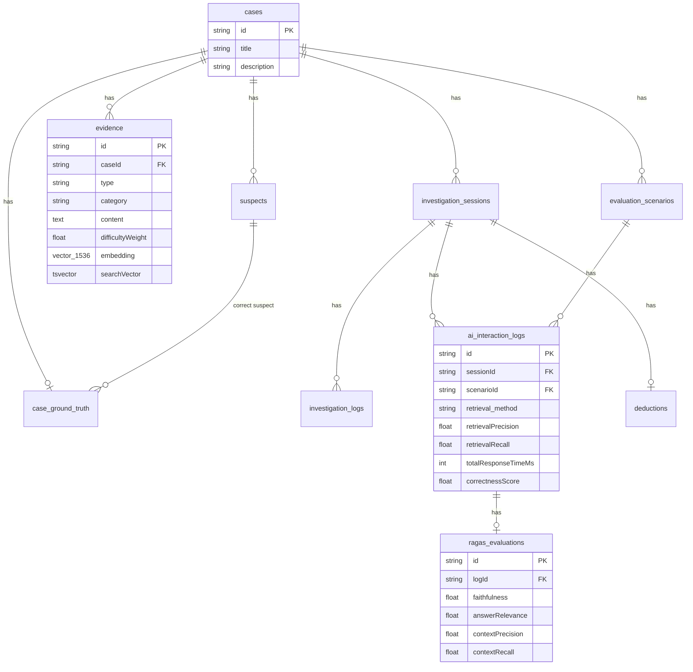

# 3. Knowledge Base Design

## Database Schema

Sistem menggunakan PostgreSQL sebagai database relasional dengan ekstensi `pgvector` untuk penyimpanan dan pencarian vektor. Schema didefinisikan di `prisma/schema.prisma`.

## Tabel-tabel Penting

### 1. `cases` (Model: `Case`)
**Peran:** Menyimpan data kasus investigasi.

| Kolom | Tipe | Keterangan |
|---|---|---|
| id | String (cuid) | Primary key |
| title | String | Judul kasus |
| description | String | Deskripsi kasus |
| createdAt | DateTime | Timestamp pembuatan |
| updatedAt | DateTime | Timestamp pembaruan |

**Relasi:** Has many `suspects`, `evidence`, `investigationSessions`, `evaluationScenarios`. Has one `groundTruth`.

### 2. `suspects` (Model: `Suspect`)
**Peran:** Menyimpan data tersangka per kasus.

| Kolom | Tipe | Keterangan |
|---|---|---|
| id | String (cuid) | Primary key |
| caseId | String | Foreign key ke `cases` |
| name | String | Nama tersangka |
| profile | Text | Profil/latar belakang tersangka |

**Relasi:** Belongs to `Case`. Referenced by `CaseGroundTruth`.

### 3. `evidence` (Model: `Evidence`)
**Peran:** Menyimpan bukti-bukti investigasi. Tabel ini berfungsi sebagai **knowledge base** utama untuk retrieval.

| Kolom | Tipe | Keterangan |
|---|---|---|
| id | String (cuid) | Primary key |
| caseId | String | Foreign key ke `cases` |
| type | String | Tipe bukti (witness_statement, forensic_report, cctv_log, financial_record, email_message, location_report) |
| category | String | Kategori bukti (financial, alibi, contradiction, location, communication, motive, forensic, noise) |
| content | Text | Konten teks bukti |
| difficultyWeight | Float | Bobot kesulitan (0.0 - 1.0) |
| embedding | vector(1536) | Vektor embedding dari OpenAI (nullable) |
| searchVector | tsvector | Full-text search vector PostgreSQL (nullable) |
| createdAt | DateTime | Timestamp pembuatan |

**Relasi:** Belongs to `Case`.

### 4. `case_ground_truth` (Model: `CaseGroundTruth`)
**Peran:** Menyimpan jawaban benar (ground truth) untuk setiap kasus.

| Kolom | Tipe | Keterangan |
|---|---|---|
| id | String (cuid) | Primary key |
| caseId | String (unique) | Foreign key ke `cases` |
| correctSuspectId | String | ID tersangka yang benar |
| contradictionPairs | Json | Pasangan bukti yang saling bertentangan |
| relevantEvidenceIds | Json | Array ID bukti yang relevan |
| optimalNextActions | Json | Tindakan optimal yang diharapkan |

**Relasi:** Belongs to `Case` and `Suspect`.

### 5. `investigation_sessions` (Model: `InvestigationSession`)
**Peran:** Menyimpan sesi investigasi pemain.

| Kolom | Tipe | Keterangan |
|---|---|---|
| id | String (cuid) | Primary key |
| caseId | String | Foreign key ke `cases` |
| retrieval_method | String | Metode retrieval yang digunakan (default: "dense") |
| createdAt | DateTime | Timestamp pembuatan |
| updatedAt | DateTime | Timestamp pembaruan |

**Relasi:** Belongs to `Case`. Has many `InvestigationLog`, `AIInteractionLog`. Has one `Deduction`.

### 6. `deductions` (Model: `Deduction`)
**Peran:** Menyimpan deduksi/kesimpulan akhir pemain.

| Kolom | Tipe | Keterangan |
|---|---|---|
| id | String (cuid) | Primary key |
| sessionId | String (unique) | Foreign key ke `investigation_sessions` |
| suspectId | String | ID tersangka yang dipilih |
| reasoning | Text | Alasan pemain |
| isCorrect | Boolean | Apakah deduksi benar |
| correctSuspectId | String | ID tersangka yang benar |

### 7. `investigation_logs` (Model: `InvestigationLog`)
**Peran:** Mencatat aksi pemain selama investigasi.

| Kolom | Tipe | Keterangan |
|---|---|---|
| id | String (cuid) | Primary key |
| sessionId | String | Foreign key ke `investigation_sessions` |
| action | String | Tipe aksi |
| target | String (nullable) | Target aksi |
| createdAt | DateTime | Timestamp |

### 8. `ai_interaction_logs` (Model: `AIInteractionLog`)
**Peran:** Tabel utama untuk logging setiap interaksi AI. Menyimpan prompt, response, metrik retrieval, timing, token usage, dan cost.

| Kolom | Tipe | Keterangan |
|---|---|---|
| id | String (cuid) | Primary key |
| sessionId | String | FK ke sessions |
| caseId | String | FK ke cases (denormalized) |
| scenarioId | String (nullable) | FK ke evaluation_scenarios (null jika bukan eval) |
| userPrompt | Text | Pertanyaan user |
| retrievedContext | Text (nullable) | Context yang di-retrieve (gabungan) |
| retrievedContextsList | Json (nullable) | Array konten evidence yang di-retrieve |
| retrievedEvidenceIds | Json (nullable) | Array ID evidence yang di-retrieve |
| retrievalScores | Json (nullable) | Skor per evidence |
| retrievalSuccess | Boolean | Apakah ada evidence relevan yang ter-retrieve |
| retrievalPrecision | Float (nullable) | Precision retrieval |
| retrievalRecall | Float (nullable) | Recall retrieval |
| topKAccuracy | Boolean (nullable) | Apakah top-K mengandung evidence relevan |
| aiResponse | Text | Respons dari LLM |
| structuredRecommendation | Json (nullable) | Rekomendasi terstruktur (JSON) |
| retrieval_method | String | Metode retrieval (sparse/dense/hybrid) |
| sparseScores | Json (nullable) | Skor sparse per evidence |
| denseScores | Json (nullable) | Skor dense per evidence |
| fusionScores | Json (nullable) | Skor fusion per evidence |
| fusion_method | String (nullable) | Metode fusion (rrf/weighted_sum) |
| embedding_time_ms | Int (nullable) | Waktu embedding (ms) |
| retrievalTimeMs | Int (nullable) | Waktu retrieval (ms) |
| llmResponseTimeMs | Int | Waktu respons LLM (ms) |
| totalResponseTimeMs | Int | Total waktu respons (ms) |
| promptTokens | Int | Jumlah token prompt |
| completionTokens | Int | Jumlah token completion |
| totalTokens | Int | Total token |
| estimatedCost | Float (nullable) | Estimasi biaya ($) |
| hallucinationDetected | Boolean | Deteksi halusinasi |
| hallucinationReason | Text (nullable) | Alasan halusinasi |
| correctnessScore | Float (nullable) | Skor kebenaran rekomendasi |
| promptTemplateVersion | String | Versi template prompt |
| createdAt | DateTime | Timestamp |

### 9. `evaluation_scenarios` (Model: `EvaluationScenario`)
**Peran:** Menyimpan skenario evaluasi yang telah di-definisikan sebelumnya.

| Kolom | Tipe | Keterangan |
|---|---|---|
| id | String (cuid) | Primary key |
| caseId | String | FK ke cases |
| prompt | Text | Pertanyaan evaluasi |
| difficulty | String | Tingkat kesulitan (easy/medium/hard) |
| requiredEvidenceIds | Json | Array ID evidence yang harus di-retrieve |
| expectedActions | Json | Array aksi yang diharapkan |
| expectedContradictions | Json (nullable) | Pasangan kontradiksi yang diharapkan |
| notes | Text (nullable) | Catatan |
| referenceAnswer | Text (nullable) | Jawaban referensi untuk RAGAS |

### 10. `ragas_evaluations` (Model: `RagasEvaluation`)
**Peran:** Menyimpan hasil evaluasi RAGAS per interaction log.

| Kolom | Tipe | Keterangan |
|---|---|---|
| id | String (cuid) | Primary key |
| logId | String (unique) | FK ke ai_interaction_logs |
| faithfulness | Float (nullable) | Skor RAGAS faithfulness |
| answerRelevance | Float (nullable) | Skor RAGAS answer relevance |
| contextPrecision | Float (nullable) | Skor RAGAS context precision |
| contextRecall | Float (nullable) | Skor RAGAS context recall |
| evaluatedAt | DateTime | Timestamp evaluasi |

## Entity Relationship Diagram

