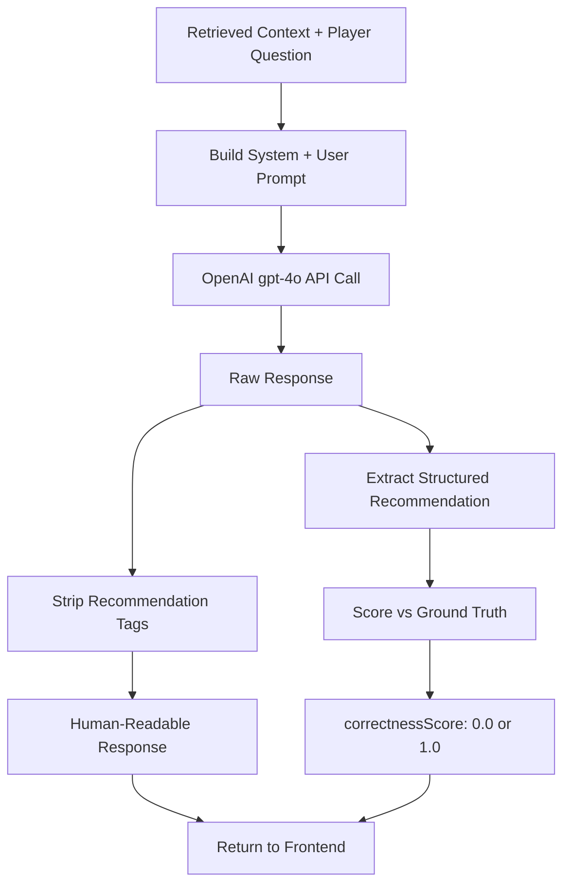

# 10. LLM Response Generation

**File implementasi:** `lib/rag.ts`

## Konfigurasi Model

| Parameter | Nilai | Lokasi |
|---|---|---|
| Chat Model | `gpt-4o` | `lib/rag.ts` line 163 |
| Temperature | 0.2 (default, configurable) | `lib/rag.ts` line 168 |
| Max Tokens | 1000 | `lib/rag.ts` line 169 |
| Streaming | Non-streaming | `lib/rag.ts` line 162-170 |

## API Call

```typescript
const response = await openai.chat.completions.create({
  model: "gpt-4o",
  messages: [
    { role: "system", content: systemPrompt },
    { role: "user", content: userPrompt },
  ],
  temperature: options?.temperature ?? 0.2,
  max_tokens: 1000,
})
```

## Response Processing

1. **Raw response** diambil dari `response.choices[0].message.content`
2. **Structured recommendation** diekstrak dari tag `<recommendation>` menggunakan regex:
   ```typescript
   function extractStructuredRecommendation(text: string): StructuredRecommendation | null {
     const match = text.match(/<recommendation>([\s\S]*?)<\/recommendation>/)
     if (!match) return null
     return JSON.parse(match[1].trim()) as StructuredRecommendation
   }
   ```
3. **Human response** dibersihkan dari tag `<recommendation>` untuk ditampilkan ke pemain:
   ```typescript
   const humanResponse = rawResponse.replace(/<recommendation>[\s\S]*?<\/recommendation>/g, "").trim()
   ```

## Cost Estimation

Biaya diestimasi berdasarkan token usage dengan tarif GPT-4o:

```typescript
const COST_PER_INPUT_TOKEN = 0.0000025   // $2.50 per 1M input tokens
const COST_PER_OUTPUT_TOKEN = 0.00001     // $10.00 per 1M output tokens

const estimatedCost = promptTokens * COST_PER_INPUT_TOKEN + completionTokens * COST_PER_OUTPUT_TOKEN
```

## Correctness Scoring

Setelah respons dihasilkan, `scoreRecommendation()` membandingkan structured recommendation dengan ground truth (`optimalNextActions`):

```typescript
const match = optimal.find(
  (a) => a.action_type === recommendation.action_type &&
         a.target === recommendation.target
)
return match ? 1.0 : 0.0
```

Skor: `1.0` jika `action_type` DAN `target` cocok dengan salah satu aksi optimal, `0.0` jika tidak.

## Response Flow


