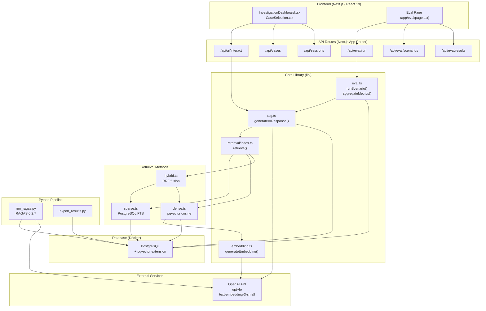
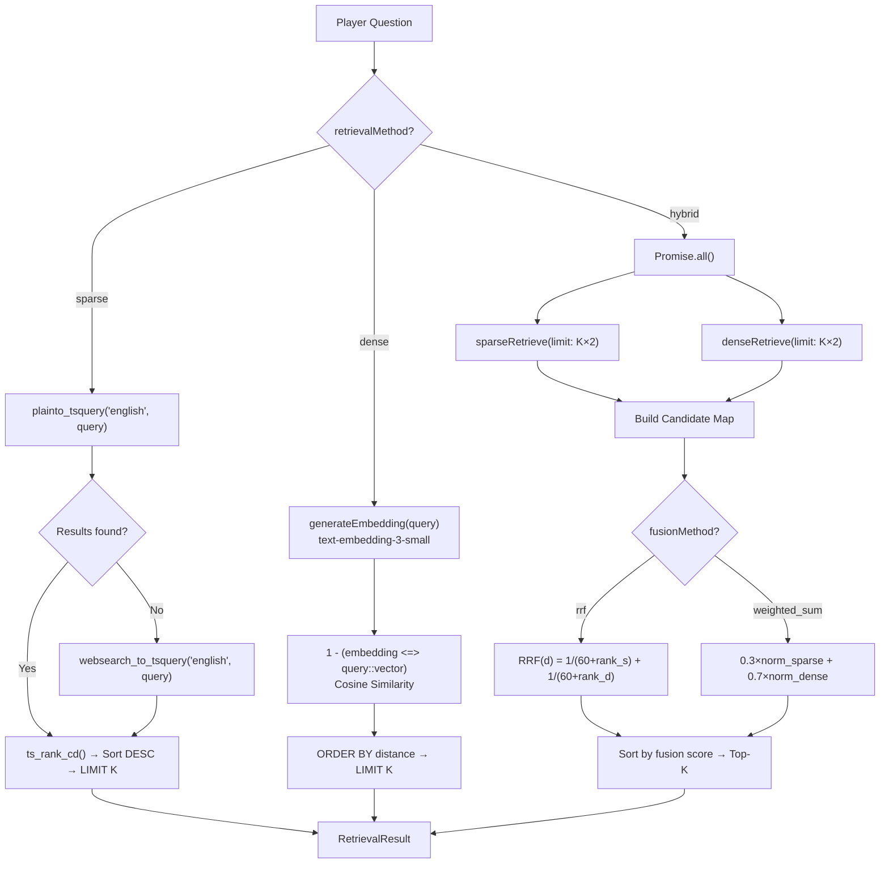
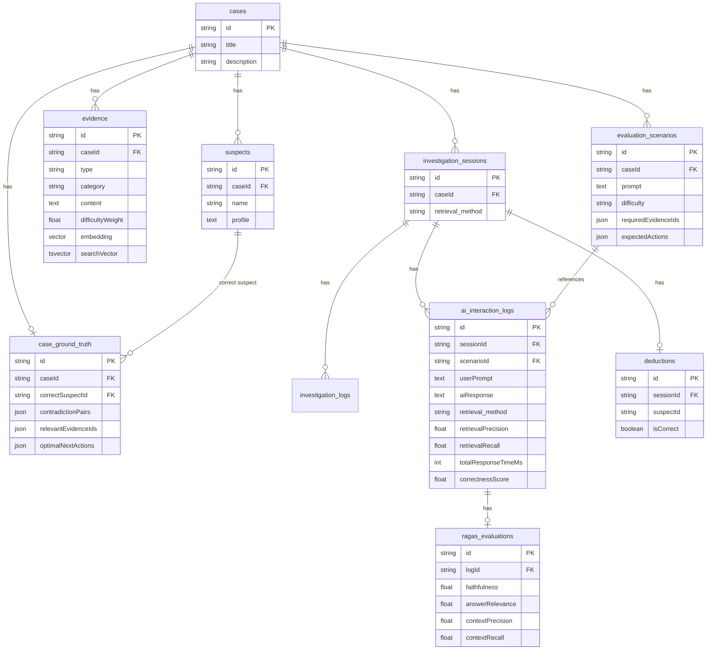
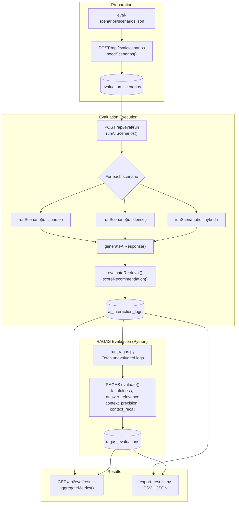

# 15. Architecture Diagrams

## 1. Overall Architecture

```mermaid
flowchart TB
    subgraph Frontend ["Frontend (Next.js / React 19)"]
        UI["InvestigationDashboard.tsx\nCaseSelection.tsx"]
        EvalUI["Eval Page (app/eval/page.tsx)"]
    end

    subgraph API ["API Routes (Next.js App Router)"]
        AI["/api/ai/interact"]
        Cases["/api/cases"]
        Sessions["/api/sessions"]
        EvalRun["/api/eval/run"]
        EvalScenarios["/api/eval/scenarios"]
        EvalResults["/api/eval/results"]
    end

    subgraph Core ["Core Library (lib/)"]
        RAG["rag.ts\ngenerateAIResponse()"]
        Retrieval["retrieval/index.ts\nretrieve()"]
        Eval["eval.ts\nrunScenario()\naggregateMetrics()"]
        Embedding["embedding.ts\ngenerateEmbedding()"]
    end

    subgraph Retrievers ["Retrieval Methods"]
        Sparse["sparse.ts\nPostgreSQL FTS"]
        Dense["dense.ts\npgvector cosine"]
        Hybrid["hybrid.ts\nRRF fusion"]
    end

    subgraph External ["External Services"]
        OpenAI["OpenAI API\ngpt-4o\ntext-embedding-3-small"]
    end

    subgraph Database ["Database (Docker)"]
        PG["PostgreSQL\n+ pgvector extension"]
    end

    subgraph Python ["Python Pipeline"]
        RAGAS["run_ragas.py\nRAGAS 0.2.7"]
        Export["export_results.py"]
    end

    UI --> AI
    UI --> Cases
    UI --> Sessions
    EvalUI --> EvalRun
    EvalUI --> EvalScenarios
    EvalUI --> EvalResults

    AI --> RAG
    EvalRun --> Eval
    Eval --> RAG

    RAG --> Retrieval
    Retrieval --> Sparse
    Retrieval --> Dense
    Retrieval --> Hybrid
    Hybrid --> Sparse
    Hybrid --> Dense

    Dense --> Embedding
    Embedding --> OpenAI
    RAG --> OpenAI

    Sparse --> PG
    Dense --> PG
    RAG --> PG
    Eval --> PG

    RAGAS --> PG
    RAGAS --> OpenAI
    Export --> PG
```

## 2. Retrieval Pipeline

```mermaid
flowchart TD
    Q[Player Question] --> R{retrievalMethod?}

    R -->|sparse| S1["plainto_tsquery('english', query)"]
    S1 --> S2{Results found?}
    S2 -->|Yes| S3["ts_rank_cd() → Sort DESC → LIMIT K"]
    S2 -->|No| S4["websearch_to_tsquery('english', query)"]
    S4 --> S3
    S3 --> OUT[RetrievalResult]

    R -->|dense| D1["generateEmbedding(query)\ntext-embedding-3-small"]
    D1 --> D2["1 - (embedding <=> query::vector)\nCosine Similarity"]
    D2 --> D3["ORDER BY distance → LIMIT K"]
    D3 --> OUT

    R -->|hybrid| H1["Promise.all()"]
    H1 --> HS["sparseRetrieve(limit: K×2)"]
    H1 --> HD["denseRetrieve(limit: K×2)"]
    HS --> H2[Build Candidate Map]
    HD --> H2
    H2 --> H3{fusionMethod?}
    H3 -->|rrf| H4["RRF(d) = 1/(60+rank_s) + 1/(60+rank_d)"]
    H3 -->|weighted_sum| H5["0.3×norm_sparse + 0.7×norm_dense"]
    H4 --> H6["Sort by fusion score → Top-K"]
    H5 --> H6
    H6 --> OUT
```

## 3. Database ER Overview

```mermaid
erDiagram
    cases ||--o{ suspects : has
    cases ||--o{ evidence : has
    cases ||--o| case_ground_truth : has
    cases ||--o{ investigation_sessions : has
    cases ||--o{ evaluation_scenarios : has

    suspects ||--o{ case_ground_truth : "correct suspect"

    investigation_sessions ||--o{ investigation_logs : has
    investigation_sessions ||--o{ ai_interaction_logs : has
    investigation_sessions ||--o| deductions : has

    evaluation_scenarios ||--o{ ai_interaction_logs : references
    ai_interaction_logs ||--o| ragas_evaluations : has

    cases {
        string id PK
        string title
        string description
    }
    suspects {
        string id PK
        string caseId FK
        string name
        text profile
    }
    evidence {
        string id PK
        string caseId FK
        string type
        string category
        text content
        float difficultyWeight
        vector embedding
        tsvector searchVector
    }
    case_ground_truth {
        string id PK
        string caseId FK
        string correctSuspectId FK
        json contradictionPairs
        json relevantEvidenceIds
        json optimalNextActions
    }
    investigation_sessions {
        string id PK
        string caseId FK
        string retrieval_method
    }
    ai_interaction_logs {
        string id PK
        string sessionId FK
        string scenarioId FK
        text userPrompt
        text aiResponse
        string retrieval_method
        float retrievalPrecision
        float retrievalRecall
        int totalResponseTimeMs
        float correctnessScore
    }
    evaluation_scenarios {
        string id PK
        string caseId FK
        text prompt
        string difficulty
        json requiredEvidenceIds
        json expectedActions
    }
    ragas_evaluations {
        string id PK
        string logId FK
        float faithfulness
        float answerRelevance
        float contextPrecision
        float contextRecall
    }
    deductions {
        string id PK
        string sessionId FK
        string suspectId
        boolean isCorrect
    }
```

## 4. Evaluation Pipeline

```mermaid
flowchart TD
    subgraph Preparation
        A["eval-scenarios/scenarios.json"] --> B["POST /api/eval/scenarios\nseedScenarios()"]
        B --> C[(evaluation_scenarios)]
    end

    subgraph Execution ["Evaluation Execution"]
        C --> D["POST /api/eval/run\nrunAllScenarios()"]
        D --> E{"For each scenario"}
        E --> F["runScenario(id, 'sparse')"]
        E --> G["runScenario(id, 'dense')"]
        E --> H["runScenario(id, 'hybrid')"]
        F --> I["generateAIResponse()"]
        G --> I
        H --> I
        I --> J["evaluateRetrieval()\nscoreRecommendation()"]
        J --> K[(ai_interaction_logs)]
    end

    subgraph RAGAS ["RAGAS Evaluation (Python)"]
        K --> L["run_ragas.py\nFetch unevaluated logs"]
        L --> M["RAGAS evaluate()\nfaithfulness, answer_relevance\ncontext_precision, context_recall"]
        M --> N[(ragas_evaluations)]
    end

    subgraph Results ["Results"]
        K --> O["GET /api/eval/results\naggregateMetrics()"]
        N --> O
        K --> P["export_results.py\nCSV + JSON"]
        N --> P
    end
```
