# Master Audit Report: Case Evidence Corpus and RAGAS Evaluation Scenarios (v2)

**Document Reference:** `docs/research-result/17-comprehensive-evidence-and-scenario-audit.md`  
**Git Branch:** `fix/audited-ragas-scenarios`  
**Base Commit:** `1578ec8` ("Preserve original scenarios and publish audited benchmark as scenario-v2.json")  
**Target Artifacts Audited:**
1. `cases-input/case-1.json` (Source evidence docket: 150 evidence records)
2. `eval-scenarios/scenario-v2.json` (Audited RAGAS benchmark: 30 scenarios)
3. `eval-scenarios/scenarios.json` (Baseline legacy benchmark: 30 scenarios)
4. `lib/eval.ts` & `prisma/seed.ts` (Scenario ingestion & benchmark loader pipeline)
5. `eval-pipeline/run_ragas.py` (RAGAS evaluation runner)

---

## Executive Summary

This report provides an exhaustive, forensic-grade audit of the experimental case evidence and evaluation scenarios used in the RAG-LLM Investigation System. It has been prepared specifically to enable **independent triple-verification** by external agents and human reviewers.

### Audit Objectives
1. **Factual Grounding:** Verify that every assertion, timestamp, IP address, numerical quantity, and deduction in `scenario-v2.json` traces directly to documented evidence in `cases-input/case-1.json` without hallucinated facts.
2. **Structural & Schema Integrity:** Validate zero-based array indexing, action taxonomies, contradiction pairs, and difficulty distributions against application database schemas and evaluation loaders.
3. **Pipeline Ingestion Safety:** Verify that benchmark loaders prevent version contamination (ensuring v1 and v2 scenarios are never merged into a single evaluation run).
4. **Metric Validity:** Analyze how reference answer phrasing, caveat statements, and retrieval budget equations in `lib/rag.ts` interact with RAGAS metrics (`faithfulness`, `answer_relevance`, `context_precision`, `context_recall`).

### Key Findings at a Glance
- **Overall Scenario Quality:** 30 out of 30 scenarios in `scenario-v2.json` are factually sound. All specific timestamps (e.g., 05:35, 01:12, 22:50), dollar amounts ($45,000, $850, $30,000, $2.1M), transfer figures (142 Mbps, 2.3 TB), and transaction details (15 ETH / ~$48,000) match the evidence records exactly.
- **Critical Pipeline Defect Identified & Patched:** Both `lib/eval.ts` and `prisma/seed.ts` originally loaded all `*.json` files in `eval-scenarios/`. Ingestion would have merged `scenarios.json` and `scenario-v2.json` into 60 simultaneous database records, violating experimental isolation. This has been resolved by introducing an explicit environment variable `EVAL_SCENARIO_FILE` (defaulting to `scenarios.json`).
- **Intrinsic Corpus Inconsistencies Documented:** Five internal contradictions and anomalies exist within the fictional evidence corpus itself (transfer rate vs. volume, provisioning authority, rotation schedules, calendar day-of-week, and IP assignment gaps). These are now explicitly addressed in scenario references rather than glossed over.
- **Scenario Refinements Applied:** 13 targeted adjustments were made to `scenario-v2.json` across Q11–Q30 (resolving non-sequiturs, adding omitted suspects to comparative prompts, refining prompt scopes, aligning contradiction pairs, and removing unreferenced noise records).

---

## 1. Ground Truth Evidence Corpus Architecture (`cases-input/case-1.json`)

### 1.1 Indexing & ID Convention
All programmatic loaders (`prisma/seed.ts`, `lib/eval.ts`, `scripts/validate-scenarios.mjs`) map `requiredEvidenceIndices` using **zero-based array indices** `[0..149]` corresponding to the order of elements in `nexus_data_breach.evidence`:
$$\text{Zero-based Index } i \iff \text{Legacy Citation ID } E(i + 1)$$
*(Example: Index `0` = $E001$; Index `149` = $E150$).*

### 1.2 Suspect Distribution Map
The 150 evidence records are partitioned into 30 items per suspect:

| Suspect Name | Designated Role in Plot | Zero-Based Indices | Legacy Labels | Primary Evidence Categories |
|---|---|---|---|---|
| **Marcus Chen** | Senior Security Engineer *(Author Culprit)* | `0` – `29` | $E001$ – $E030$ | Network logs, Git history, ProtonMail, Signal, crypto wallet, smart home telemetry, noise |
| **Dr. Sarah Okonkwo** | Chief Technology Officer *(Red Herring)* | `30` – `59` | $E031$ – $E060$ | Badge logs, audit queries, divorce filings, DLP logs, Uber receipt, noise |
| **Viktor Petrov** | DevOps Engineer *(Suspicious Red Herring)* | `60` – `89` | $E061$ – $E090$ | Infrastructure privileges, CCTV, bar alibi, consulting business (PetrovTech), noise |
| **Aisha Rahman** | Data Analyst *(Clearly Innocent)* | `90` – `119` | $E091$ – $E120$ | Flight records, manifest, phone airplane mode, read-only permissions, noise |
| **James Whitfield** | VP of Sales *(Motive Without Technical Skills)* | `120` – `149` | $E121$ – $E150$ | Steakhouse dinner, Meridian loss memo, competitor CEO call, standard business laptop profile, noise |

### 1.3 Intrinsic Evidence Inconsistencies (Corpus-Level Anomalies)

The fictional case contains several internal contradictions and gaps. These are **not** bugs in the evaluation scenarios, but features of the corpus that reference answers must account for:

```mermaid
graph TD
    subgraph Transfer Conflict
        ISP["Evidence [4]: ISP Deep Packet Inspection<br/>142 Mbps sustained (02:15-04:45)<br/>Total: ~159.75 GB"]
        Router["Evidence [11]: Home Router Traffic<br/>Total: 2.3 TB outbound<br/>(02:15-04:45)"]
        ISP -.->|"Direct Volume Contradiction"| Router
    end

    subgraph Authority Conflict
        Audit["Evidence [1]: Service Account Audit<br/>svc-threatfeed provisioned by<br/>marcus.chen@nexusdynamics.com"]
        Role["Evidence [60]: IT Org Records<br/>Viktor Petrov responsible for<br/>provisioning ALL service accounts"]
        Audit -.->|"Scope / Authority Conflict"| Role
    end

    subgraph Rotation Schedule Conflict
        VikRot["Evidence [84]: Rotation Logs<br/>Viktor reset password Oct 15, 2026<br/>Quarterly rotation cycle"]
        Sched["Evidence [19]: Credential Audit Log<br/>Marcus reset password Jan 13, 2027<br/>'Previous scheduled rotation not due until Feb 1'"]
        VikRot -.->|"Oct 15 + 90 days = Jan 13 vs Feb 1"| Sched
    end
```



1. **Data Transfer Volume vs. Bandwidth (Evidence [4] vs. Evidence [11]):**
   - Evidence [4]: ISP metadata records sustained upstream averaging 142 Mbps between 02:15 and 04:45 (2.5 hours = 9,000 seconds). In decimal units:
     $$142 \text{ Mbps} \times 9000 \text{ s} = 1,278,000 \text{ Mb} \approx 159.75 \text{ GB}$$
   - Evidence [11]: Home router logs 2.3 TB of outbound transfer for the exact same interval.
   - *Impact on Scenarios:* Evaluated in Q22, Q26, Q27, Q29. References must highlight this numerical conflict rather than endorsing either figure as undisputed truth.
2. **Service Account Provisioning Authority (Evidence [1] vs. Evidence [60]):**
   - Evidence [1]: Audit trail states `svc-threatfeed` was provisioned on October 3, 2026 by `marcus.chen@nexusdynamics.com`.
   - Evidence [60]: IT org records state Viktor Petrov is responsible for "provisioning all service accounts across the Nexus Dynamics production environment."
   - *Impact on Scenarios:* Evaluated in Q05, Q09, Q18.
3. **Credential Rotation Scheduling (Evidence [84] vs. Evidence [19]):**
   - Evidence [84]: Scheduled reset performed by Viktor on October 15, 2026 as part of a "quarterly credential rotation cycle".
   - Evidence [19]: Marcus reset password on January 13, 2027; log notes "previous scheduled rotation was not due until February 1" (which uses the word "previous" where "next" is intended, and 108 days from Oct 15 is not quarterly).
   - *Impact on Scenarios:* Evaluated in Q05, Q18, Q21, Q25.
4. **Calendar Day-of-Week Error (Evidence [59]):**
   - Evidence [59]: Automated calendar reminder for "Monday morning team standup" sent at 06:00 on January 15, 2027.
   - *Real-world Calendar:* January 15, 2027 falls on a **Friday**.
5. **Residential IP Assignment Gap (Evidence [0] vs. Evidence [4], [11]):**
   - Evidence [0]: VPN tunnel originated from residential IP `74.125.224.72`.
   - Evidence [4] & [11]: Detail fiber line and home router traffic at "Marcus Chen's residence", but no ISP subscriber record explicitly ties the IP `74.125.224.72` to Marcus Chen's account.
   - *Impact on Scenarios:* Evaluated in Q12, Q27.
6. **Embedded Narrative Leakage in Source Docket:**
   - In `cases-input/case-1.json`, suspect profiles explicitly label roles: `"Marcus Chen (CULPRIT)"`, `"Dr. Sarah Okonkwo (red herring)"`, `"Aisha Rahman (clearly innocent)"`.
   - Evidence [135]: Contains author interpretation inside evidence content: *"Context suggests frustration about compensation, not criminal intent."*

---

## 2. Ingestion Pipeline & Architecture Analysis

### 2.1 Multi-File Directory Ingestion Hazard (P0 Issue - Resolved)
Prior to this audit, both `lib/eval.ts` (line 28) and `prisma/seed.ts` (line 109) contained the following logic:
```typescript
const files = readdirSync(dir).filter((f) => f.endsWith(".json"))
for (const f of files) {
  // loads and seeds all scenario files found
}
```
**Impact:** Having both `scenarios.json` (30 items) and `scenario-v2.json` (30 items) in `eval-scenarios/` resulted in seeding **60 scenario records** under the same case title ("The Nexus Data Breach"). Furthermore, `seedScenarios()` in `lib/eval.ts` wiped all existing database scenarios and recreated 60 rows, silently breaking historical evaluation telemetry and doubling benchmark execution costs.

**Resolution Applied:**
Both loaders are now explicitly pinned to a single target file using the `EVAL_SCENARIO_FILE` environment variable with safe fallback to `scenarios.json`:
- In `lib/eval.ts`:
  ```typescript
  export const EVAL_SCENARIO_FILE = process.env.EVAL_SCENARIO_FILE || "scenarios.json"
  export async function loadScenarioFiles(): Promise<ScenarioInputFile[]> {
    const raw = JSON.parse(
      readFileSync(join(process.cwd(), "eval-scenarios", EVAL_SCENARIO_FILE), "utf8")
    )
    return Array.isArray(raw) ? raw : [raw]
  }
  ```
- In `prisma/seed.ts`:
  ```typescript
  const scenarioFile = process.env.EVAL_SCENARIO_FILE || "scenarios.json"
  if (!existsSync(join(dir, scenarioFile))) { ... return }
  const files = [scenarioFile]
  ```

### 2.2 Retrieval Budget Dynamic Coupling (`lib/rag.ts`)
The retrieval limit $k$ in `lib/rag.ts` is dynamically determined by the number of labeled indices:
```typescript
const labelCount = options?.requiredEvidenceIds?.length ?? 0
const effectiveLimit = options?.limit ?? (labelCount > 5 ? Math.min(20, Math.max(10, labelCount + 2)) : 8)
```
**Evaluation Consideration:** Adding or removing evidence indices from `requiredEvidenceIndices` alters the retrieval budget $k$ for that scenario (e.g., expanding from 5 to 6 labels jumps the budget from $k=8$ to $k=10$). When comparing benchmark runs between v1 and v2, researchers must account for this variable.

### 2.3 RAGAS Ground Truth & Context Recall Dynamics
In `eval-pipeline/run_ragas.py`, scenario evaluations execute as follows:
```python
l."retrievedContextsList" as contexts,
s."referenceAnswer" as ground_truth
...
rec_score = context_recall.score(...)
```
`context_recall` prompts an evaluator LLM to decompose `ground_truth` into individual factual claims and check whether each claim is present in `contexts`.
- **Finding:** Meta-reasoning sentences in reference answers (e.g., *"These are comparative indicators, not a proof by elimination"*) cannot be substantiated by retrieved evidence chunks.
- **Consequence:** Such statements artificially depress the raw numerical `context_recall` score across all retrieval methods equally. The relative rankings between Sparse, Dense, and Hybrid remain valid, but aggregate absolute scores are lower.

### 2.4 Contradiction Pair Specification Divergence
The case source file `case-1.json` defines three ground truth contradiction pairs:
1. `[2, 3]`: Marcus claims he was asleep vs. smart home occupancy sensor active 01:45–05:35.
2. `[2, 4]`: Marcus claims no company system access vs. high-bandwidth sustained upload from home.
3. `[61, 62]`: Viktor claims 17:00 departure vs. lobby security camera footage exiting at 19:15.

In `scenario-v2.json`, pairs `[2, 3]` and `[2, 4]` were omitted from `expectedContradictions` across all Marcus scenarios (Q11, Q23, Q26, etc.), keeping only Viktor's direct statement-vs-log pairs (`[61, 62]`, `[61, 63]`, `[61, 64]`, `[61, 65]`).
- **Rationale:** An occupancy sensor registers room presence, not personal identity (it does not prove Marcus specifically was awake); outbound traffic does not prove destination to company networks. Hence, they are circumstantial evidentiary challenges rather than strict logical contradictions.
- **Audit Decision:** Retained as designed in v2, but documented clearly for verifiers.

---

## 3. Comprehensive 30-Scenario Audit & Verification Matrix

The table below catalogs all 30 scenarios in `scenario-v2.json`. Every row has been verified against `cases-input/case-1.json`:

| # | Diff. | Prompt Summary | Required Evidence Indices (0-based) | Expected Actions | Expected Contradictions | Audit Status | Key Supporting Evidence & Notes |
|---|---|---|---|---|---|---|---|
| **Q01** | Easy | What flight was Aisha Rahman on during the breach? | `[91, 92, 93]` | `EXAMINE_EVIDENCE` (Aisha) | `[]` | Clean | `91`: Ticket NX-447 (23:30 Dulles). `92`: Gate B12 scan (23:15). `93`: Manifest seat 14C. |
| **Q02** | Easy | Documented technical access & tools for James Whitfield | `[130, 131, 132, 133]` | `EXAMINE_EVIDENCE` (James) | `[]` | Clean | `130`: Standard business profile. `131`: Software inventory. `132`: No certs. `133`: No DB queries. |
| **Q03** | Easy | Service account used and who created it | `[0, 1]` | `EXAMINE_EVIDENCE` (Marcus) | `[]` | Clean | `0`: `svc-threatfeed` VPN tunnel. `1`: Provisioned Oct 3, 2026 by marcus.chen. |
| **Q04** | Easy | When Dr. Sarah Okonkwo left office on breach night | `[30, 31, 36, 37, 38]` | `EXAMINE_EVIDENCE` (Sarah) | `[]` | Clean | `30`: Badge exit 01:30. `31`: Statement 01:30. `36`: Guard Torres log 01:30. `37`: Uber 01:35. `38`: Home 02:08. |
| **Q05** | Easy | Viktor Petrov's role and systems managed | `[60, 70, 84, 85]` | `EXAMINE_EVIDENCE` (Viktor) | `[]` | Clean | `60`: DevOps/VPN/service accounts. `70`: Admin rights. `84`: Oct 15 reset. `85`: Nov matrix audit. |
| **Q06** | Easy | Potential financial/career motive indicators for Marcus | `[7, 8, 9, 15, 16]` | `EXAMINE_EVIDENCE` (Marcus) | `[]` | Clean | `7`: 15 ETH ($48k). `8`: Passed over for CISO. `9`: Colleague statement. `15`: Signal thread. `16`: $45k debt. |
| **Q07** | Easy | Aisha Rahman permissions & breach method viability | `[97, 98, 99, 112, 113]` | `EXAMINE_EVIDENCE` (Aisha) | `[]` | Clean | `97`: Read-only. `98`: Select queries. `99`: 500 MB download. `112`: 0 escalation reqs. `113`: 0 API calls. |
| **Q08** | Easy | Where James Whitfield was on evening of Jan 14 | `[120, 121, 122, 123, 124, 125]` | `EXAMINE_EVIDENCE` (James) | `[]` | Clean | `120`: Statement. `121`: Dinner service ends 22:45. `122`: Card charge $850 at 22:50. `123`: Uber. `124`: Home 23:25. `125`: Phone inactive after 00:15. |
| **Q09** | Easy | Suspects with access/admin control over svc-threatfeed | `[1, 13, 19, 41, 60, 70, 84]` | `EXAMINE_EVIDENCE` (Marcus) | `[]` | Clean | Covers Marcus (`1, 13, 19`), Sarah (`41`), Viktor (`60, 70, 84`). |
| **Q10** | Easy | Cryptocurrency evidence related to the breach | `[6, 7, 15, 21]` | `EXAMINE_EVIDENCE` (Marcus) | `[]` | Clean | `6`: Escrow email. `7`: 15 ETH wallet deposit. `15`: Signal delivery message. `21`: Browser searches. |
| **Q11** | Med | Evaluate Marcus Chen's alibi for night of breach | `[2, 3, 10, 12, 14, 17, 18, 22]` | `INTERROGATE` (Marcus) | `[]` | Refined | Dropped noise label `23` (food order). Added explicit note that Netflix (`22`) continued to 23:25. Sensor `3` ends at 05:35. |
| **Q12** | Med | Evidence supporting/weakening Sarah Okonkwo breach role | `[0, 30, 31, 32, 33, 36, 37, 38, 39, 40, 41, 45, 55]` | `EXAMINE_EVIDENCE` (Sarah) | `[]` | Refined | Clarified that residential VPN began 02:00 while Uber placed her in transit to 02:05. Phone inactivity corrected to 02:15–06:45 (`39`). |
| **Q13** | Med | Analyze Viktor Petrov movements and timeline Jan 14–15 | `[61, 62, 63, 64, 65, 66, 74, 77, 78]` | `INTERROGATE` (Viktor) | `[61, 62]`, `[61, 63]`, `[61, 64]`, `[61, 65]` | Refined | Added missing contradiction pair `[61, 63]` (claimed 17:00 departure vs. badge exit 19:17) to match Q23. |
| **Q14** | Med | Compare suspects' motives, technical access, and links | `[0, 1, 4, 7, 8, 16, 34, 35, 41, 45, 55, 67, 68, 70, 97, 103, 126, 130, 136]` | `INTERROGATE` (Marcus) | `[]` | Refined | Added Aisha Rahman (`97`: read-only, `103`: clean screening) to fulfill prompt's request for "the suspects". |
| **Q15** | Med | Compare documented business/transaction external contacts | `[6, 15, 69, 127, 128, 134]` | `EXAMINE_EVIDENCE` (Marcus) | `[]` | Scope Adj. | Removed unsupported prompt clause ("separating them from internal messages"). Corrected note citation for Sarah's attorney (`53`/E054). |
| **Q16** | Med | Evidence weakening Aisha/James role and remaining limits | `[91, 92, 93, 94, 97, 113, 130, 131, 133]` | `EXAMINE_EVIDENCE` (Aisha) | `[]` | Clean | Grounds travel alibi and account restrictions without claiming impossible participation. |
| **Q17** | Med | Compare financial profiles of all five suspects | `[7, 16, 35, 44, 67, 68, 87, 103, 126, 136]` | `EXAMINE_EVIDENCE` (Marcus) | `[]` | Refined | Clarified company lost Meridian contract with James as lead (`126`). Added `87` (Viktor client invoices). |
| **Q18** | Med | Trace creation, credential mgmt, reset of svc-threatfeed | `[1, 13, 19, 60, 70, 84, 85]` | `EXAMINE_EVIDENCE` (Marcus) | `[]` | Refined | Added `60`. Explicitly highlighted corpus conflicts: Viktor provisioning all accounts vs Marcus, and Oct 15 vs Feb 1 rotation. |
| **Q19** | Med | Was Viktor Petrov consulting a cover for selling data? | `[65, 66, 67, 68, 69, 74, 78, 86, 87]` | `EXAMINE_EVIDENCE` (Viktor) | `[]` | Clean | Bar closed 01:30 (`65`), home 01:55 (`66`). VPN window 02:00–05:00 not covered by bar alibi. |
| **Q20** | Med | Was James Whitfield's contact with competitor CEO related? | `[126, 127, 128, 129, 134, 135, 138, 148]` | `EXAMINE_EVIDENCE` (James) | `[]` | Refined | Clarified that phone call (`134`) is documented in phone billing logs, not an audio recording. |
| **Q21** | Med | Compare Dr. Okonkwo and Marcus Chen access and activity | `[1, 13, 19, 32, 40, 41, 45, 55]` | `EXAMINE_EVIDENCE` (Marcus) | `[]` | Clean | Differentiates audit activity (`32, 40`) from credential vault access (`13`) and off-schedule reset (`19`). |
| **Q22** | Med | Breach-night network records & device artefacts | `[0, 4, 5, 11, 17, 20, 21]` | `EXAMINE_EVIDENCE` (Marcus) | `[]` | Scope Adj. | Refined prompt to match actual reference scope ("breach-night network records and recovered device artefacts"). Highlights 142 Mbps vs 2.3 TB conflict. |
| **Q23** | Hard | Documented conflicts & circumstantial challenges to statements | `[2, 3, 4, 18, 22, 61, 62, 63, 64, 65]` | `REVIEW_TIMELINE` (Marcus & Viktor) | `[61, 62]`, `[61, 63]`, `[61, 64]`, `[61, 65]` | Refined | Clarified that Netflix (`22`) ending at 23:25 is only a marginal challenge to the 23:00 sleep claim. |
| **Q24** | Hard | Construct hypothesis linking prep, breach, transaction | `[0, 1, 4, 5, 6, 7, 11, 13, 15, 19, 20, 21]` | `EXAMINE_EVIDENCE`, `INTERROGATE` (Marcus) | `[]` | Clean | Hypothesizes chain of events while acknowledging unproven gaps (Signal date, transfer volume discrepancy). |
| **Q25** | Hard | Prioritized suspect for clarification & grounded questions | `[0, 1, 2, 3, 4, 6, 7, 13, 19]` | `INTERROGATE` (Marcus) | `[]` | Clean | Frames grounded questions on sensor time (05:35), off-schedule reset, repository access, and 15 ETH wallet. |
| **Q26** | Hard | Reconstruct timeline of Marcus Chen & devices Jan 14–15 | `[0, 2, 3, 4, 10, 11, 12, 14, 17, 18, 22, 23, 27]` | `REVIEW_TIMELINE` (Marcus) | `[]` | Refined | Replaced vague "transfer figures require correction" with explicit conflict between 142 Mbps (~160 GB) and 2.3 TB. |
| **Q27** | Hard | Cross-reference digital & location records for suspects | `[0, 2, 3, 4, 5, 11, 17, 20, 33, 38, 45, 55, 66, 74, 78, 94, 96, 113, 124, 125, 130, 131]` | `EXAMINE_EVIDENCE`, `INTERROGATE` (Marcus) | `[]` | Refined | Added Sarah home cam (`38`), Viktor home GPS (`66`), James home cam (`124`) to substantiate location cross-referencing. |
| **Q28** | Hard | Records connecting Marcus to marketplace & unverified parts | `[5, 6, 7, 15, 20, 21]` | `EXAMINE_EVIDENCE` (Marcus) | `[]` | Clean | Covers ShadowVault cache (`5`), ProtonMail (`6`), Signal (`15`), NAS directory structure (`20`), and searches (`21`). |
| **Q29** | Hard | Strongest evidence-based case, facts vs inferences | `[0, 1, 2, 3, 4, 5, 6, 7, 8, 9, 11, 13, 15, 16, 18, 19, 20, 21]` | `EXAMINE_EVIDENCE`, `INTERROGATE` (Marcus) | `[]` | Clean | Synthesizes full evidentiary picture, explicitly noting that account creator $\neq$ operator and volume conflicts. |
| **Q30** | Hard | Most strongly supported final deduction & uncertainty | `[0, 1, 2, 3, 4, 5, 6, 7, 8, 11, 15, 16, 19, 20]` | `EXAMINE_EVIDENCE`, `INTERROGATE` (Marcus) | `[]` | Refined | Added Signal thread (`15`) to support plural "communications". Concludes with stated uncertainty. |

---

## 4. Detailed Breakdown of Applied Fixes (Audit Diff Verification)

Below is the verbatim record of modifications applied to `eval-scenarios/scenario-v2.json` to resolve evidentiary and semantic gaps:

### Q11: Marcus Chen Alibi Evaluation
- **Field:** `requiredEvidenceIndices`
  - *Before:* `[2, 3, 10, 12, 14, 17, 18, 22, 23]`
  - *After:* `[2, 3, 10, 12, 14, 17, 18, 22]`
  - *Rationale:* Removed index `23` (Golden Dragon dinner receipt ordered at 20:00), an unreferenced noise record.
- **Field:** `referenceAnswer`
  - *Added:* `"Netflix streaming on his account continued until 23:25, slightly after his stated sleep time."`
  - *Rationale:* Provides direct evidentiary justification for retaining index `22` in required evidence.

### Q12: Dr. Sarah Okonkwo Breach Hypothesis
- **Field:** `referenceAnswer`
  - *Before:* `"The breach VPN used a residential address, but Sarah had already left the office before it began."`
  - *After:* `"The breach VPN session began at 02:00 from a residential IP address while the Uber receipt places her in transit until 02:05; no record maps that IP to her address."`
  - *Rationale:* Resolves a logical non-sequitur (leaving the office does not preclude connecting from a residence; the actual contradiction is that she was in transit until 02:05 while the session started at 02:00).
  - *Correction:* Fixed phone inactivity statement from "no activity after 02:15" to "no network activity or app usage between 02:15 and 06:45", matching Evidence [39] precisely.

### Q13: Viktor Petrov Movement Analysis
- **Field:** `expectedContradictions`
  - *Before:* `[{61, 62}, {61, 64}, {61, 65}]`
  - *After:* `[{61, 62}, {61, 63}, {61, 64}, {61, 65}]`
  - *Rationale:* Added `[61, 63]` (Viktor's claimed 17:00 departure vs. badge exit scan at 19:17), which was already labeled in indices and matched Q23.

### Q14: Suspect Comparison
- **Field:** `requiredEvidenceIndices`
  - *Before:* `[0, 1, 4, 7, 8, 16, 34, 35, 41, 45, 55, 67, 68, 70, 126, 130, 136]`
  - *After:* `[0, 1, 4, 7, 8, 16, 34, 35, 41, 45, 55, 67, 68, 70, 97, 103, 126, 130, 136]`
- **Field:** `referenceAnswer`
  - *Added:* `"Aisha’s account is read-only and her screening report lists no outstanding debts."`
  - *Rationale:* The prompt asks to compare "the suspects" (plural), but the reference answer completely omitted Aisha Rahman. Added records `97` (read-only) and `103` (clean background).

### Q15: External Communications Comparison
- **Field:** `prompt`
  - *Before:* `"Compare the documented business or transaction-related communications with outside parties, separating them from internal messages."`
  - *After:* `"Compare the documented business or transaction-related communications with outside parties."`
  - *Rationale:* No internal messages were provided in the evidence indices or referenced in the answer; removing this requirement prevents penalizing models for omitting nonexistent internal messages.
- **Field:** `notes`
  - *Correction:* Corrected note citation from "E055/E054 memuat kontak pengacara Sarah" to "E054 memuat kontak pengacara Sarah" (Evidence [53] / E054 is the attorney phone call; Evidence [54] / E055 is the executive assistant statement).

### Q17: Suspect Financial Profiles
- **Field:** `requiredEvidenceIndices`
  - *Added:* `87` (Viktor's declared client invoices).
- **Field:** `referenceAnswer`
  - *Before:* `"James lost a $2.1 million annual contract and experienced a 40% commission decline."`
  - *After:* `"James was account lead on the $2.1 million annual Meridian contract that the company lost, and his variable compensation fell 40% in Q4 2026."`
  - *Rationale:* Corrected attribution according to Evidence [126] (the company lost the contract; James was account lead) and supported Viktor's consulting legitimacy with invoice record [87].

### Q18: Credential Management & Reset of svc-threatfeed
- **Field:** `requiredEvidenceIndices`
  - *Added:* `60` (IT organizational records for Viktor).
- **Field:** `referenceAnswer`
  - *Added:* `"One record states that Viktor provisions all service accounts, which conflicts with the audit trail attributing svc-threatfeed’s creation to Marcus; a quarterly cycle from October 15 also does not align with the stated February 1 rotation date."`
  - *Rationale:* Directly surfaces the corpus-level contradictions in authority and scheduling.

### Q20: Competitor CEO Contact
- **Field:** `referenceAnswer`
  - *Before:* `"James made a recorded call to that CEO..."`
  - *After:* `"James called that CEO, as documented in phone records..."`
  - *Rationale:* Evidence [134] documents a 7-minute phone record entry, not an audio recording.

### Q22: Digital Records & Artefacts
- **Field:** `prompt`
  - *Before:* `"What digital records and recovered artefacts are relevant to the breach, and what do they establish or leave uncertain?"`
  - *After:* `"What breach-night network records and recovered device artefacts are relevant to the breach, and what do they establish or leave uncertain?"`
  - *Rationale:* The original prompt was so broad it encompassed half the case file. Narrowed to breach-night telemetry and device artefacts to align with the actual evidence labeled.

### Q23: Conflict & Challenge Strength
- **Field:** `referenceAnswer`
  - *Refined:* Replaced `"challenged by office occupancy, lights, and account streaming"` with `"challenged by office occupancy and lights, and only marginally by Netflix streaming that ended at 23:25"`, reflecting that a 25-minute streaming overlap on an approximate 23:00 sleep claim is weak evidence.

### Q26: Marcus Device Timeline
- **Field:** `referenceAnswer`
  - *Before:* `"...transfer figures require correction."`
  - *After:* `"...the ISP rate (142 Mbps) and router volume (2.3 TB) conflict."`
  - *Rationale:* Explicitly cites the conflicting evidence parameters instead of using vague meta-language.

### Q27: Cross-Referencing Suspect Records
- **Field:** `requiredEvidenceIndices`
  - *Added:* `38` (Sarah home cam 02:08), `66` (Viktor GPS arrival home 01:55), `124` (James home cam 23:25).
- **Field:** `referenceAnswer`
  - *Added:* `"Sarah, Viktor, and James are each recorded at home before or near the start of the window, so presence at a residence does not by itself distinguish them."`
  - *Rationale:* Fully satisfies the prompt's mandate to cross-reference location records across suspects.

### Q30: Final Supported Deduction
- **Field:** `requiredEvidenceIndices`
  - *Added:* `15` (Signal messaging extraction on personal phone).
  - *Rationale:* Supports the reference answer's plural reference to Marcus's "communications".

### Universal Provenance Stamp
In all 30 scenarios, the `notes` field was prepended with:
> `"Review findings below refer to the original v1 item and motivated this revision."`
This eliminates ambiguity for future evaluators reviewing why certain indices or text comments are discussed in `notes`.

---

## 5. Verification Checklist & Instructions for Verifying Agents

To triple-verify these findings, an independent agent should execute the following automated checks and inspections in sequence:

### Step 1: Automated Offline Test Suite Execution
Run the test suites (which require zero database connections or external API calls):
```powershell
npm run eval:validate
npm run test:scenarios
npx tsc --noEmit -p .
```
- **Expected Result:**
  - `eval:validate`: Reports `Validated 30 scenarios (offline; no database or model calls).`
  - `test:scenarios`: Reports 6 passing tests, 0 failing tests.
  - `tsc`: Clean compilation without TypeScript errors.

### Step 2: Zero-Based Evidence Index Bounds & Existence Check
Run a quick script to verify that every required evidence index exists and resolves to the correct suspect:
```powershell
node -e '
const fs = require("fs");
const cases = JSON.parse(fs.readFileSync("cases-input/case-1.json", "utf8")).nexus_data_breach;
const scenarios = JSON.parse(fs.readFileSync("eval-scenarios/scenario-v2.json", "utf8"));
scenarios.forEach((s, idx) => {
  const q = `Q${String(idx+1).padStart(2, "0")}`;
  for (const i of s.requiredEvidenceIndices) {
    if (i < 0 || i >= cases.evidence.length) throw new Error(`${q} has out-of-bounds index: ${i}`);
  }
});
console.log("All required evidence indices exist and are strictly within [0..149].");
'
```

### Step 3: Pinned Loader Verification
Inspect `lib/eval.ts` and `prisma/seed.ts` to confirm that neither file performs an unbounded directory read that merges all JSON files:
- Confirm `lib/eval.ts` references `process.env.EVAL_SCENARIO_FILE || "scenarios.json"`.
- Confirm `prisma/seed.ts` references `process.env.EVAL_SCENARIO_FILE || "scenarios.json"`.

### Step 4: Verification Sign-Off Table

| Verification Criterion | Verification Status | Notes / Reference Location |
|---|---|---|
| Total Scenario Count | Verified: 30 | Exactly 10 easy, 12 medium, 8 hard |
| Total Evidence Count | Verified: 150 | `case-1.json` length = 150 |
| Action Taxonomies Valid | Verified | Actions restricted to `EXAMINE_EVIDENCE`, `INTERROGATE`, `REVIEW_TIMELINE` |
| Contradiction Endpoints Valid | Verified | All contradiction endpoints are distinct and present in `requiredEvidenceIndices` |
| Ingestion Isolation | Verified | Pinned via `EVAL_SCENARIO_FILE` environment variable |
| Numerical Accuracy | Verified | 142 Mbps, 2.3 TB, 05:35, 15 ETH, $45k debt, $2.1M contract verified against source |
